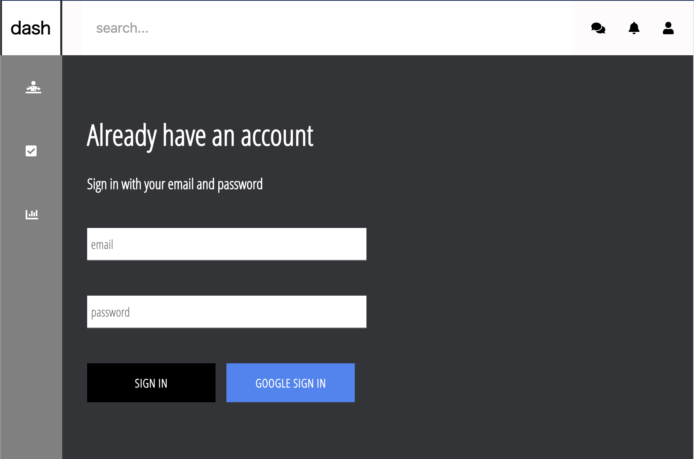

### Dashboard Boilerplate Testing App

This project is a basic desktop application for testing for a startup. It is to include:
  - sign in and create user account
  - basic layout of pages and  components, ready for API and users database
  - SCSS, CSS to fit given UI design

### Sign in and create account page

  
  
  
### To Get Started

Clone or download the repository and run
### `npm install`

To run the fron-end, run:

### `npm start`

